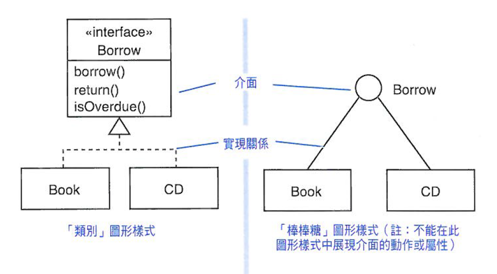
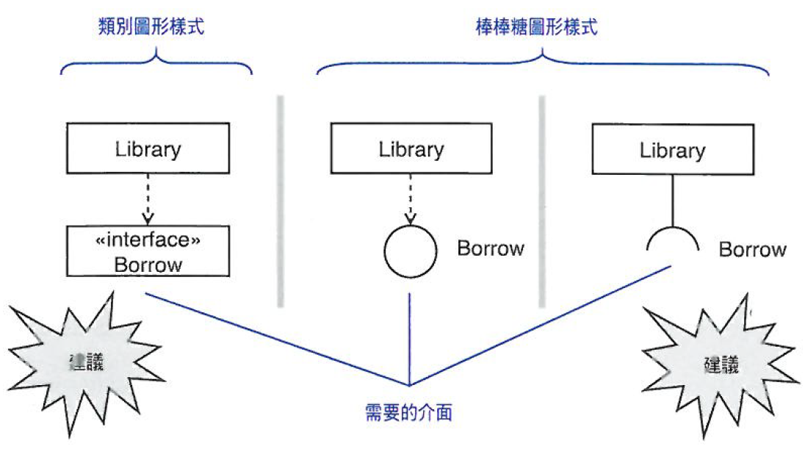
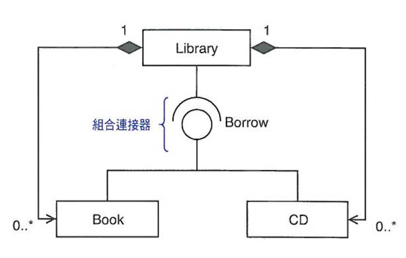
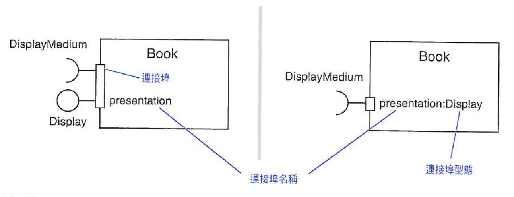
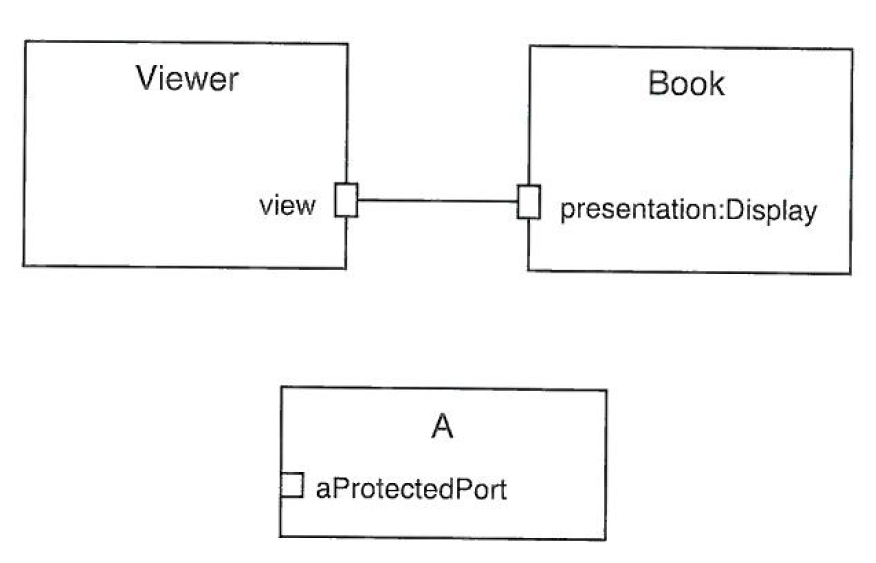

# Unit 11 介面圖 (Interface)

定義了一組具名的公開特徵

> 「類別」圖關係為虛線箭頭，棒棒糖圖關係為實現

上圖可改成下圖

> 組合連接器：是一個「連接一個提供服務，另一個需求該服務的兩個組件間的連接器。一個組件連接器定義了一個從必需接口到提供接口或埠的連接器。」這代表著兩個組件間「服務消費者——服務提供者」的關係

## 定義屬性與特徵要點

* 完整動作規格(名稱、參數型態、回傳型態)
* 動作的語意說明-用文字或虛擬碼描述
* 屬性的名稱與型態
* 任一動作或屬性的造型、約束條件與標籤值

## 連接埠 (port)

介面群組化

port在邊上代表公開，port在邊內代表隱藏或保護

## 介面特徵

介面特徵(中文) | 介面特徵(英文) | 類詞實現方式
---------|----------|----------
 動作 | Operation | 相同特徵與語法的動作
 屬性 | Attribute | 公開的動作來傳送與接收屬性值 
 關聯 | Association | 目標類詞關聯
 約束 | Constraint | 約束條件
 造型 | stereotype | 造型
 標籤值 | Tagged Value | 標籤值
 協定 | Protocol | 實現協定 