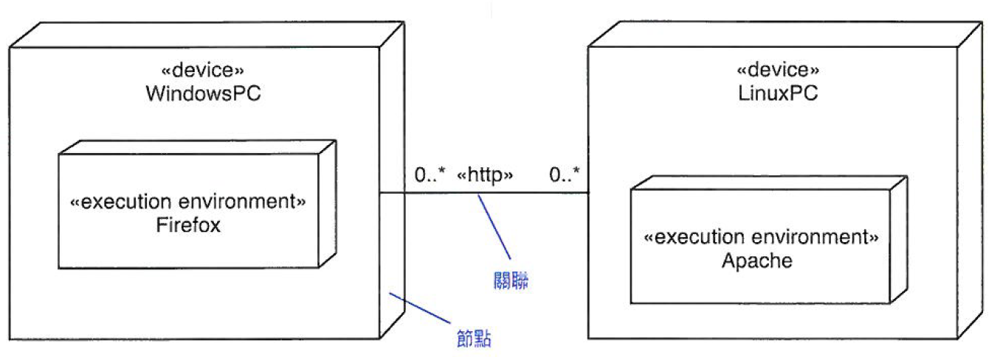
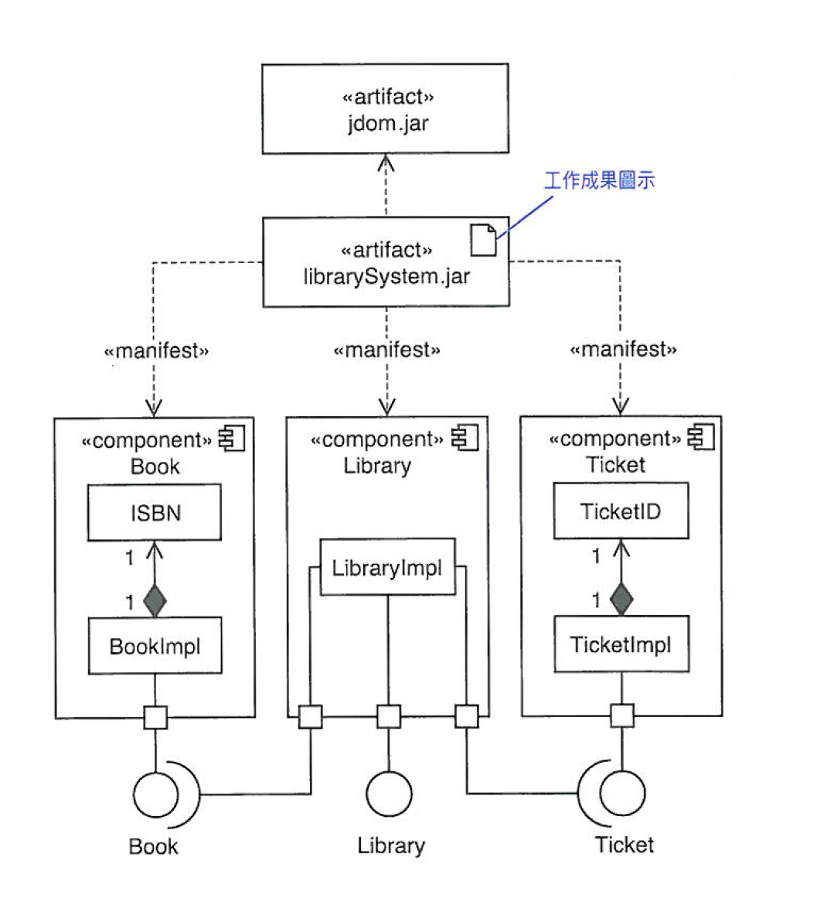

# Unit 12 部署圖 (Deployment Diagram)

將工作成果指定給節點

## 描述形式 (Descriptor form)

包含節點，節點間的關係與工作成果。

### 節點

硬體

### 工作成果 (Artifact)

軟體

## 實力形式 (Instance Form)

包含節點實例，節點實例間的關係與工作成果實例

### 節點實例

可是識別的硬體

### 工作成果實例

軟體實例

## 節點

運算資源，工作成果可部署並執行。節點可巢狀

### `<<device>>`

實體設備節點，例：PC

### `<<execution enviroment>>`

軟體執行環境，例：Apache

## 工作成果 (Artifact)

具體的、真實世界事物的詳細說明。

* 原始檔
* 執行檔
* script檔
* 資料庫
* 文件
* 開發過程的產出

### `<<manifest>>`

工作成果還要依賴其他工作成果

> Manifest資源配置文件：在Java平台中, Manifest資源配置文件是JAR檔案文件[1][2]中包含的特殊文件。Manifest文件被用來定義擴展或檔案打包相關數據。Manifest文件是一個元數據文件，它包含了不同部分中的名/值對數據。

