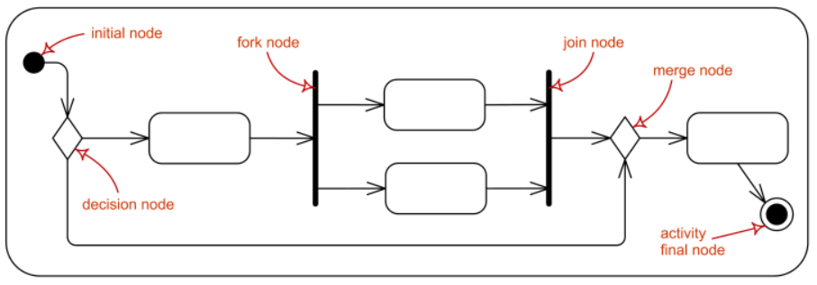
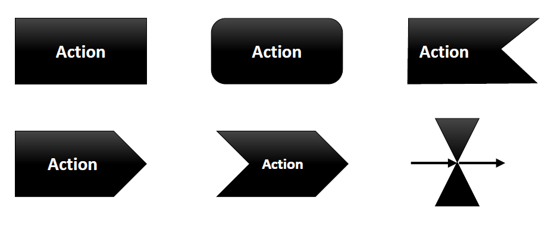
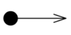

# Unit 5 活動圖 (Activity Diagram)

> **物件導向式的流程圖**  
> 描述流程中主要活動與各活動彼此間的關係 
> 多個邊(edge)與節點(node)相互所構成的活動流程 

### 節點(node)
1.  動作節點 (Action node)
    > 活動裡不可分割的工作單元

    * 動作 (action) ： 簡單不可分割行為
    * 活動 (activity) ： 一組動作

    

2.  控制節點 (Control node)
    > 控制整個活動流程

    

    * 開始節點 (Initial Node) ： 活動開始
    * 活動結束節點 ( final-activity node) ： 用來停止活動的所有`物件流`及`控制流`
    * 流程結束節點 (flow-final node) ： 用來停止特定活動的`物件流`及`控制流`
    * 決策節點 (decision node) ： 根據條件走訪路徑
         > 標示門檻條件(guard condition) ： 走訪這條路徑的測試值

    * 合併節點 (merge node) ： 會合`決策節點`導致的分叉路徑

        
        

    * 分叉節點 (fork node) ： 將流程分割成數個併行或平行流程
        > 泳道 (又稱`活動段落` ， Swimlane)： 辨識活動圖的分解 ， 易於閱讀

    * 連接節點 (join node) ： 會合平行或併行流程

        

3. 物件節點 (Object node)
    > 活動裡使用的物件  
    > 代表從一個活動流程到另一個活動的資訊

    

    * 緩衝區
        > 等待被其他節點接受

        * 定義緩衝區如何運作 

            
            
        * 選擇行為

            > 條件附加於節點選擇輸入邊的物件形成

            

    * 表現物件狀態 `[ ]`
        > 時空的停頓

        

    * 參數 `( )`
        > 活動的輸入輸出窗口  
        > 繪製位置必須與框重疊

        

### 邊(edge)
1. 控制流程 (control flow)
    > 活動控制權的流向

2. 物件流程 (object flow)
    > 物件裡物件的流向  
    > 物件的輸入與輸出

    

### 黑洞活動 (black hole activities)
> 沒有流出的活動

### 奇蹟活動 (miracle activity)
> 沒有流入的活動

### 活動段落
> 讓活動圖易於閱讀

----
## 補充

### Node 

| 名稱(中文) | 名稱(英文) | 用途 | 圖示 | 備註 |
|---|---|---|---|---|
| 動作 | action | 簡單不可分解的行為|  | Action Node |
| 活動 | activity | 一組動作 |     | Action Node |
| 物件節點 | object node | 代表從一個活動流程到另一個活動的資訊 |  | Object Node |
| 開始節點 | Initial Node |  活動開始 |   | Control Node  |
| 活動結束節點 |  activity-final node |  用來停止活動的所有`物件流`及`控制流` |  |   Control Node |
| 流程結束節點 | flow-final node | 用來停止特定活動的`物件流`及`控制流` |  | Control Node |
| 決策節點 | decision node | 根據條件走訪路徑 |     | `OR` 關係   Control Node |
| 合併節點 | merge node | 會合`決策節點`導致的分叉路徑 |     | `OR` 關係   Control Node |
| 分叉節點 | fork node |  將流程分割成數個併行或平行流程 |   | `AND` 關係   Control Node |
| 連接節點 | join node | 會合平行或併行流程 |   | `AND` 關係   Control Node |
| 控制流程 | control flow | 活動控制權的流向 |  | edge |
| 物件流程 | object flow | 物件裡物件的流向 |    | edge |

#### Action Node

| 名稱 | 用途 | 圖示 | 
|---|---|---|
| 呼叫動作節點 | 呼叫活動、系統行為或動作 |   |
| 傳送訊號 | 「產生」某一個特定的信號  傳送非同步訊號，可接收輸入參數 |   |
| 接收事件動作節點 | 「等待」某一個特定事件發生 |    |
| 接收時間事件動作節點 | 對時間事件的回應   因為有時我們需要等待一段時間後，才會進行下一個動作，或周期定時執行一些動作  |    |

* :: 
    > 分隔活動段落

* ( , ) 
    > 標明活動在活動段落架構下的位置，若活動分布於一格以上段落，我們以逗號分隔活動段落。

    
* 耙子符號(Rake) 
    > 代表動作呼叫某個活動，節點名稱與呼叫的活動相同

    

*  \<\<external\>\>
> 活動圖與外部系統溝通  
> 外部活動段落並非系統一部份

* ( )
    > 參數

* [ ] 
    > condition , state

* { } 
    > constraint (強限制) , tagged value (弱限制，標記值)

