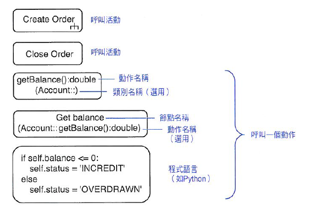
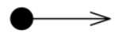

# Unit 5 活動圖 (Activity Diagram)

> 描述流程中主要活動與各活動彼此間的關係 
> 多個邊(edge)與節點(node)相互所構成的活動流程

### 節點(node)
1.  動作節點 (Action node)
    > 活動裡不可分割的工作單元

    * 動作 (action) ： 簡單不可分割行為
    * 活動 (activity) ： 一組動作

2.  控制節點 (Control node)
    > 控制整個活動流程

    * 開始節點 (Initial Node) ： 活動開始
    * 活動結束節點 ( final-activity node) ： 用來停止活動的所有`物件流`及`控制流`
    * 流程結束節點 (flow-final node) ： 用來停止特定活動的`物件流`及`控制流`
    * 決策節點 (decision node) ： 根據條件走訪路徑
         > 標示門檻條件(guard condition) ： 走訪這條路徑的測試值

    * 合併節點 (merge node) ： 會合`決策節點`導致的分叉路徑
    * 分叉節點 (fork node) ： 將流程分割成數個併行或平行流程
        > 泳道 ： 辨識活動圖分解

    * 連接節點 (join node) ： 會合平行或併行流程

3. 物件節點 (Object node)
    > 活動裡使用的物件  
    > 代表從一個活動流程到另一個活動的資訊

### 邊(edge)
1. 控制流程 (control flow)
    > 活動控制權的流向

2. 物件流程 (object flow)
    > 物件裡物件的流向

### 黑洞活動 (black hole activities)
> 沒有流出的活動

### 奇蹟活動 (miracle activity)
> 沒有流入的活動

----
## 補充

| 名稱(中文) | 名稱(英文) | 用途 | 圖示 | 備註 |
|---|---|---|---|---|
| 動作 | action | 簡單不可分解的行為|  | Action Node |
| 活動 | activity | 一組動作 |  | Action Node |
| 物件節點 | object node | 代表從一個活動流程到另一個活動的資訊 |  | Object Node |
| 開始節點 | Initial Node |  活動開始 |   | Control Node  |
| 活動結束節點 |  final-activity node |  用來停止活動的所有`物件流`及`控制流` | |   Control Node |
| 流程結束節點 | flow-final node | 用來停止特定活動的`物件流`及`控制流` | | Control Node |
| 決策節點 | decision node | 根據條件走訪路徑 |  | `OR` 關係   Control Node |
| 合併節點 | merge node | 會合`決策節點`導致的分叉路徑 |  | `OR` 關係   Control Node |
| 分叉節點 | fork node |  將流程分割成數個併行或平行流程 |  | `AND` 關係   Control Node |
| 連接節點 | join node | 會合平行或併行流程 |  | `AND` 關係   Control Node |
| 控制流程 | control flow | 活動控制權的流向 |  | edge |
| 物件流程 | object flow | 物件裡物件的流向 |  | edge |

