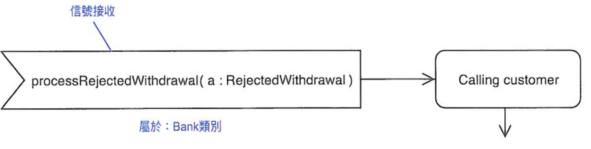

# Unit 8 狀態機 (State Machine)

* 描述系統動態行為
* 被動物件生命週期
* 每個類別有多個狀態機

## 狀態 (State)

物件在其生命中因滿足某些條件、展現某些活動或等待某些事件時的一個條件或情況，隨著時間的改變，物件狀態也會改變，不過在特定的時間點上物件也會中止，中止原因：物件的屬性值、和其他物件的關係、物件展現得活動。

> 被動物件：
> * 會回應外部事件(物件本體之外的事件)
> * 會產生與回應內部的事件
> * 會用一連串的狀態、轉換與事件來描述生命週期
> * 現在的行為是依據過去的行為而生

### Composite State

一個狀態是由多個狀態組合而成

## 事件 (Event)

時空間中發生的事項

### 呼叫事件

呼叫類別實例的某個特定動做

### 信號事件

信號是一個資訊封包，可以非同步的在物件傳遞

> 信號傳遞凸五角形代表

> 信號接收凹五角形代表

### 變化事件

布林表示式表示，事件的值由 false 轉為 true 時，開始執行。系統在狀態內會一直不斷測試布林值

### 時間事件

關鍵字 `when` 、 `after` ，特定時間點驅動

## 轉換 (Transition)

反應事件過程中從一個狀態移動到另一個狀態

### 轉換的連接-虛擬狀態 (Junction Pseudo_State)

表合併或分支傳換點

> 若連接虛擬狀態有一個以上的轉換輸出點，則每個輸出的轉換一定要受到互斥判斷條件的保護，讓同一時間僅有一個轉換發生

### 轉換的分支-選擇虛擬狀態

表現簡單的分支而不要有合併

### 內部轉換

描述模型中雖然有發生某些事情但是並沒有觸發任何的狀態的轉換，是由於不夠重要

## 行為狀態機 (Behavioral State Machine)

定義類詞行為，用來描述類詞部分的行為，但有些類詞是沒有行為的，例：介面、連接埠，指定義使用使用協定。

### 狀態

一個或多個進入(Entered)、停留(Resided in)、或離開(Exited)狀態時的動作

#### 動作(Action)與活動(Activity)

* 每個狀態機中都包含0個以上動作(Action)與活動(Activity)
* 動作(Action)：花費時間瞬間且不可中斷
* 活動(Activity)：花費時間一段時間且是可以中斷

 

### 轉換

簡單語法表示

* 零個以上的事件：指名哪些可以觸發的外部或內部事件
* 零個或一個判斷條件：布林算表示式，true才會發生狀態轉換
* 零個以上的Action：一連串與轉換相關的作業，且發生在轉換開始的瞬間

 

> 在狀況 event1 or event2 發生時，若 guardCondition 為 true 時，則 anAction 進入狀態 B 

#### 外部

箭頭線條表示

#### 內部

顯示在狀態內部`*`

## 協定狀態機(Protocol State Machine)

定義類詞中的協定，例：呼叫類詞及其實例動作後的狀態、呼叫動作後的結果、呼叫動作的順序。不會定義實作內容，僅定義面對外部實體時該如何表現

### 狀態

不會指明任何動作

### 轉換

* 沒有動作，因為指名的是協定內容不是實作內容
* 判斷條件由前置條件(Precondition)與後置(Postcondition)所取代

## 圖示語意

圖稱(中文) | 圖稱(英文) | 語意 | 圖示
---------|----------|---------- | ----------
初始狀態 | Initail Pseudostate | 狀態起始 | 
結束狀態 | Final Pseudostate | 狀態結束 |  
轉換 | Transition | 狀態改變，只含箭頭 | 
事件 | Event | 時空間中發生的事項，傳換箭頭上方 | 
進入 | Entry Point Pseudostate | 狀態機的進入點 | 
離開 | Exit Point Pseudostate |  狀態機的離開點  | 
終止 | Terminate Pseudostate | 表示狀態終止 |