# Unit 8 套件圖 (Package)

* 套件圖案是資料夾
* 套件名稱放置資料夾上方
* 套件內的所有名稱必須獨一無二
* 可見性一定要設定

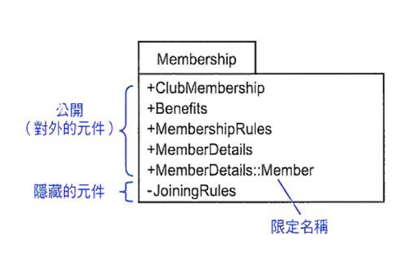

> 限定名稱(Qualified Name)：又稱`路徑名稱(Pathname)`，`領域名稱`加上`元件名稱`，元件須要參考不同名稱的領域內的元件時，必須同時指明元件的名稱以及元件所在的名稱領域。例：Library::Users::Librarian

符號 | 可見性 | 語意
---------|----------|---------
 `+` | public | 元件能在套件外看到
 `-` | private | 元件隱藏在套件內

 ## 巢狀套件

 套件包在套件中

 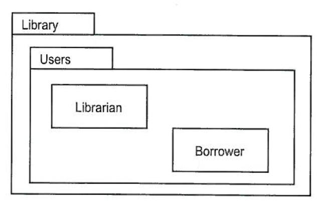
 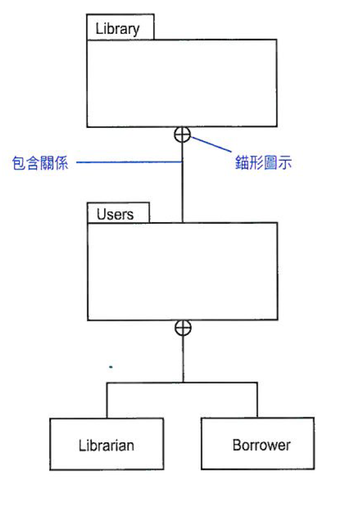

 ## 相依性關係
 
相依關係 | 語意 | 圖示 | 備註
---------|----------|---------- | ----------
 `<< use >>` | 使用者套件中的元件可以使用供應套件中公開的元件。 使用者依賴供應者 | 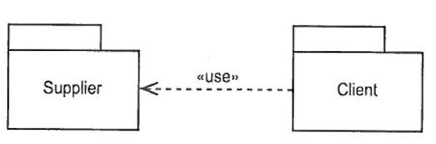 | 沒有任何造型時就是 `<< use >>` 相依性關係
 `<< import >>` | 供應者名稱領域中公開的元件會加入到使用者名稱領域中，並成為使用者名稱領域中的**公開**元件 | 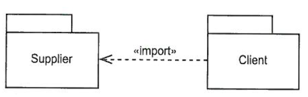 | 使用者的元件可以在不使用限定名稱情況下存取供應者所有的公開的元件   有遞移性
 `<< access >>` | 供應者名稱領域中公開的元件會加入到使用者名稱領域中，並成為使用者名稱領域中的**隱藏**元件 | 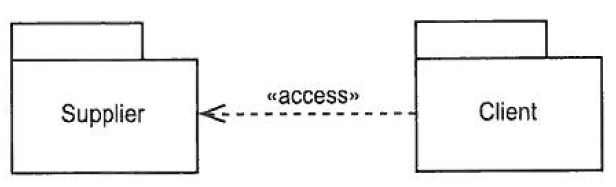 | 使用者的元件可以在不使用限定名稱情況下存取供應者所有的公開的元件
 `<< trace >>` | 用來表示發展的歷程不同版本之間的關係 | 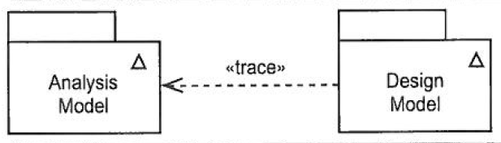 | 運用在模型上，比較不適用在元件上   小三角形表示已完成的UML模型
 `<< merge >>` | 供應者套件的公開元件與使用者套件的元件合併 | 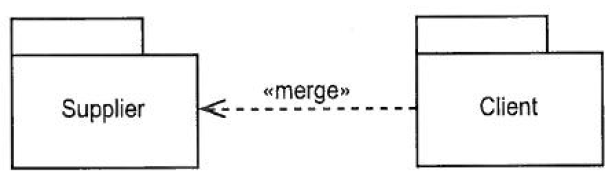 | 用在描述模型裡，不應該再OOSAD中看到

 > 遞移性：A物件與B物件存在相依，且B物件與C物件也存在相，則A物件與C物件就會產生相依

 ## 一般化

 子套件會繼承父套件的公開元件，若子套件與父套件元件名稱相同會覆寫

 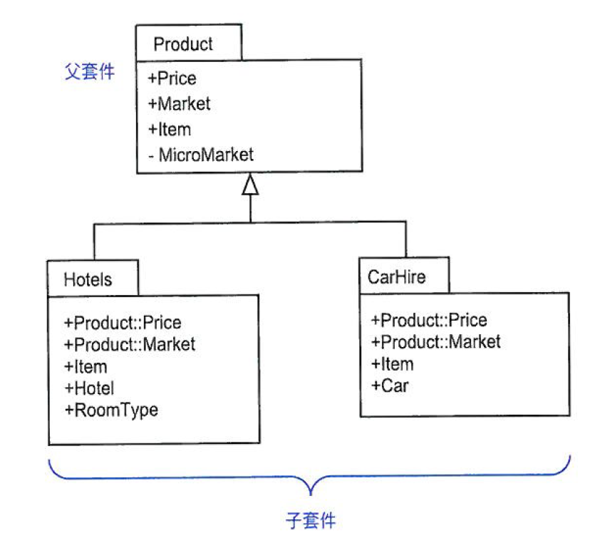

 ## Model

 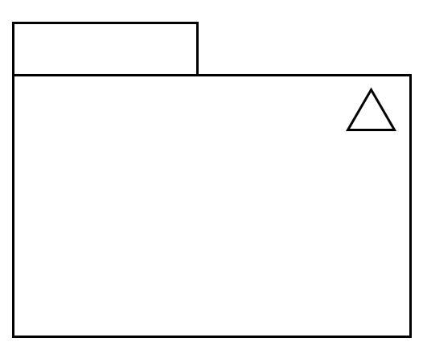

  ## System

 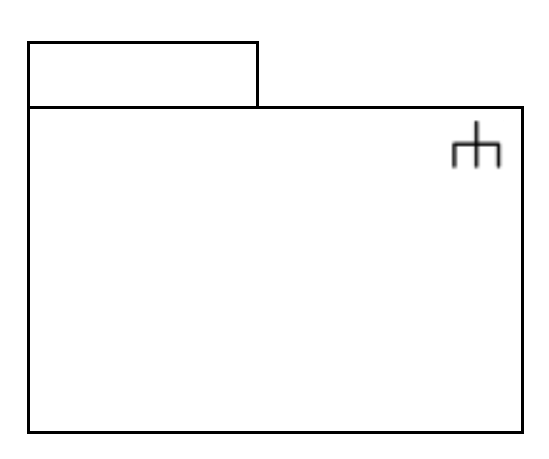
