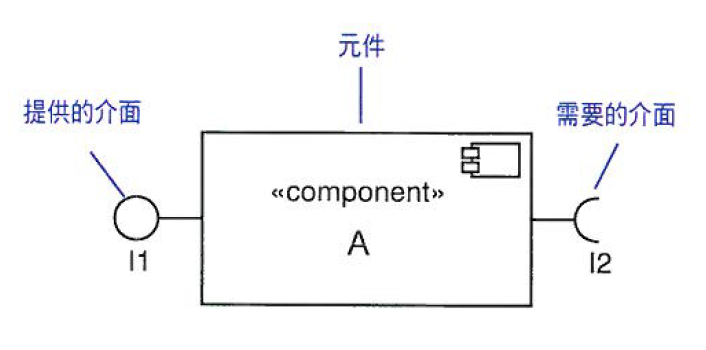
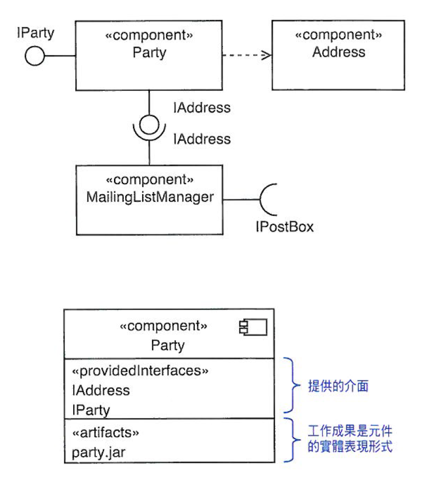
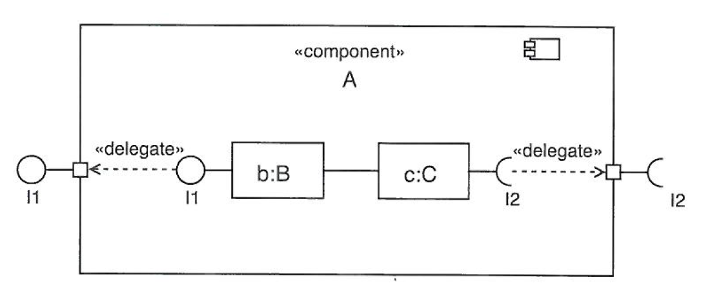
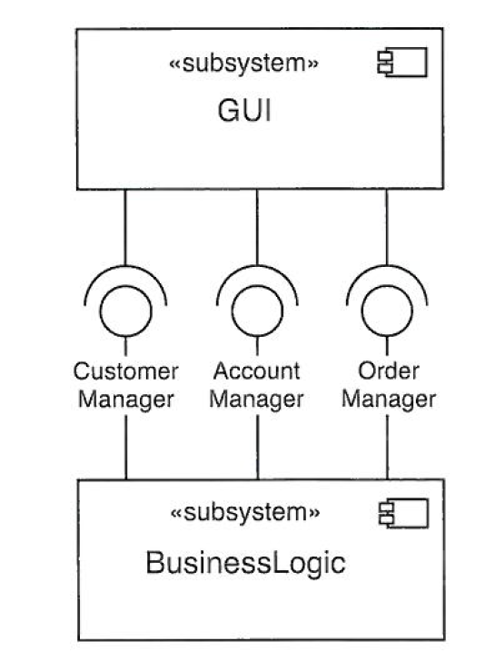

# 元件圖(Component)

* 系統中的模組，能封裝內容並在其環境中替換
* 元件由一個或多個工作成果(Artifact)組成

## 組合連接線 (Assembly Connector)

## 子系統 (SubSystem)

大系統分解出的小單位

## 元件造型

造型 | 語意
---------|----------
 `<< buildComponent >>` | 元件定義出一組支援組織或系統發展之物體
 `<< entity >>` | 一種儲存資訊的元件，表現商業上的概念
 `<< implemetation >>` | 實作 `<< specification >>` 
 `<< specification >>` | 指明物件領域無實作
 `<< process >>` | 處理交易元件
 `<< service >>` | 與狀態無關，計算值的功能元件
 `<< subsystem >>` | 從大系統拆解開的單位